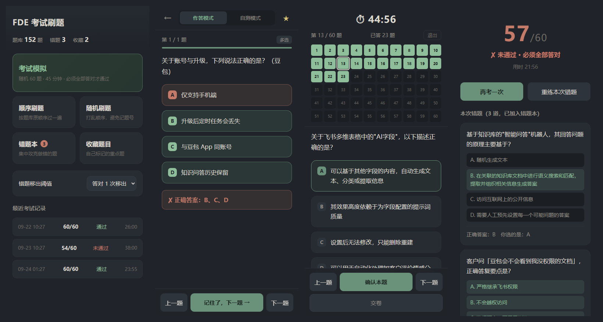

# 刷题

> 手机端选择题刷题网页。纯静态、零依赖、完全离线可用，自带错题本和考试模拟。
> A dependency-free, offline-first quiz web app for mobile. Single HTML file, no build step.



把 `index.html` 和 `questions.js` 丢到任意静态托管上就能用。内置的是 152 道 FDE 认证考试题，换成你自己的题库只需要改一个文件。

---

## 为什么做这个

手机端刷题工具要么是装一堆 App、要么是网页要联网还要登录、要么是夜间看久了眼睛疼。这个项目想解决的就三件事：

- **打开就能用** —— 不需要后端、不需要登录、不需要联网，飞行模式下也能刷
- **真的能帮你记住** —— 错题本会记录你错了多少次、连续答对几次，答对了才放你走
- **夜里看不刺眼** —— 整套配色是按长时间阅读调的，不是把白底网页反色了事

## 功能

**刷题模式** —— 顺序刷或随机刷，顶栏可随时切换两种子模式：

- **作答模式**：选完点「提交」判题。选对的标绿，选错的标红且正确答案同时标绿，弹出结论条和解析。答错自动进错题本。
- **自测模式**：系统不判题。点「显示答案」后正确答案标绿，你自己判断「我答对了 / 我答错了」，点错才记入错题本。

每题右上角有收藏星标，底部「上一题 / 下一题」翻页，桌面端还支持方向键和数字键 1–4 选选项。

**错题本** —— 每题分别记录「累计错次」和「连续对次」，答错时连续对次清零。可以设置答对 1 / 2 / 3 次才移出（默认 1 次），达到阈值才真正从错题本消失。支持打乱顺序集中重练，也能在卡片上手动移出。

**考试模拟** —— 随机抽 60 题，45 分钟倒计时，最后 5 分钟数字变红（只变色，不闪烁），到点自动交卷。顶部是 10×6 的题号点阵：灰色未答、绿色已答、米白描边是当前题，可以直接点击跳转。**60 题全部答对才通过**。结果页列出全部错题和解析，可以「再考一次」或「重练本次错题」。

## 快速开始

因为数据存在 `localStorage`，直接双击 `index.html`（`file://` 协议）时部分浏览器会禁用本地存储，错题本和考试记录会存不下来。要完整功能就起个本地服务：

```bash
# 任选一种
python -m http.server 8000
npx serve .
```

然后打开 `http://localhost:8000`。

## 部署

生成的是纯静态文件，任何静态托管都能放。

**Cloudflare Pages**：新建项目 → 上传 `index.html` 和 `questions.js`（构建命令留空，输出目录填 `/`）。或用命令行：

```bash
npx wrangler pages deploy . --project-name=your-project
```

**GitHub Pages**：仓库 Settings → Pages → Source 选 `main` 分支的 `/ (root)`。

**Vercel / Netlify**：直接拖文件夹进去，无需任何构建配置。

## 换成你自己的题库

只改 `questions.js` 一个文件。每题的结构是：

```js
const QUESTIONS = [
  {
    id: 1,                          // 题号，必须唯一
    q: "题干文本",
    type: "单选",                    // "单选" 或 "多选"，只影响界面上的标签显示
    options: ["选项A", "选项B", "选项C", "选项D"],
                                    // 选项文本，不要带 "A. " 前缀，界面会自动加
    answer: [1],                    // 正确选项的【下标】，从 0 开始：A=0 B=1 C=2 D=3
                                    // 单选写 [1]；多选写 [0, 2, 3]
    explain: "解析文本"              // 可选。不写就不显示解析区
  },
  // ...
];
```

判题规则是**选中集合与 `answer` 完全一致才算对** —— 多选少选、多选都算错。

几个实现上的约定：

- 选项数量不限于 4 个，界面用的是 `LETTERS[i]`，支持 A–F
- 四个选项全对（全选型题目）是支持的，题库里有 16 道这样的题
- `explain` 留空时解析区不渲染，不会留白框
- 题库不足 60 题时，点「考试模拟」会提示而不是抽不满就开考

## 项目结构

```
.
├── index.html          # 整个应用：HTML + CSS + 原生 JS，无框架无构建
├── questions.js        # 题库数据，唯一需要改的文件
├── screenshots/        # README 用的截图
└── LICENSE
```

`index.html` 内部按注释分成了几块：CSS 变量主题区、五个页面（首页 / 刷题 / 错题本 / 考试 / 结果）、数据层、三个功能模块、事件绑定。想改配色直接看 CSS 顶部的 `:root` 变量。

## 设计说明

配色不是随手挑的，是按"夜里长时间阅读不刺眼"倒推的：

| 用途 | 色值 | 说明 |
| --- | --- | --- |
| 背景 | `#20242a` | 暖调深灰，不是纯黑（纯黑配亮字对比过强，反而累） |
| 正文 | `#dcd8cf` | 米白，不是纯白 |
| 强调 | `#7fae8e` | 低饱和暖绿 |
| 答对 | `#8fbf9a` | 柔和草绿 |
| 答错 | `#c47a68` | 柔和砖红，刻意避开鲜红 |

其余约束：题干字号 ≥17px、行距 1.75、选项为大点击区域（最小高度 56px）、**全程零闪烁动画**（倒计时最后 5 分钟只变红不闪）、深色主题 `theme-color` 一并设好。

数据全部存在 `localStorage`，键名分别是 `fde_wrong` / `fde_fav` / `fde_exams` / `fde_settings`。没有后端，也不会上传任何东西。

## 浏览器支持

需要支持 CSS `:has()` 的现代浏览器 —— Chrome 105+、Safari 15.4+、Firefox 121+。2023 年之后的手机浏览器都没问题。

## License

[MIT](LICENSE)
